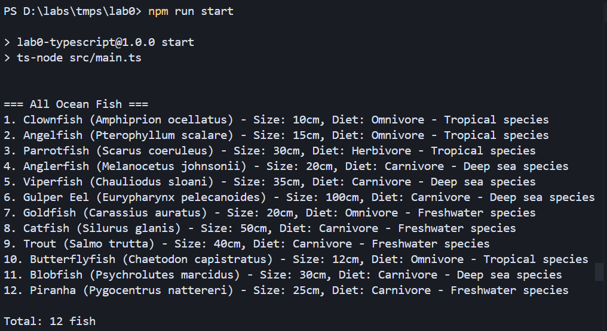
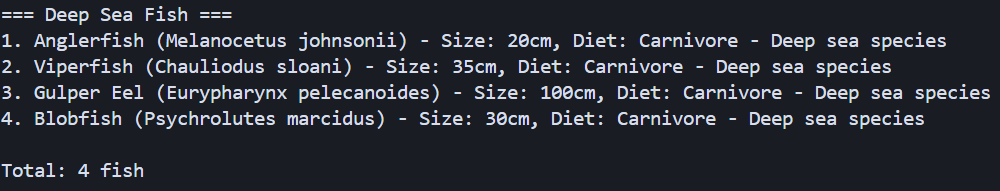
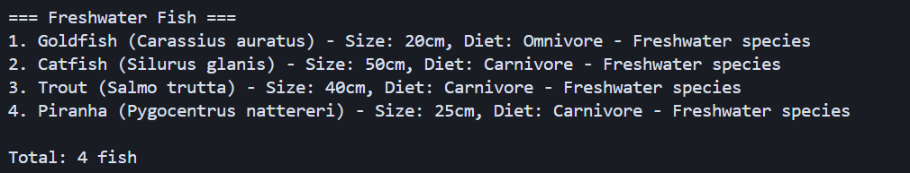
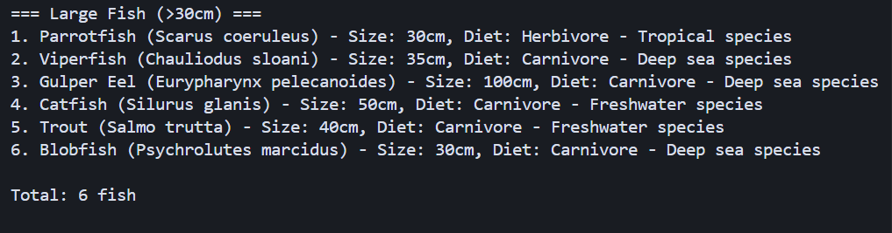
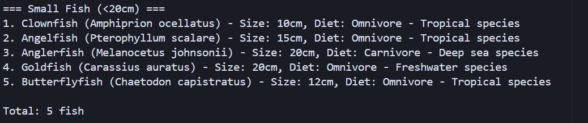
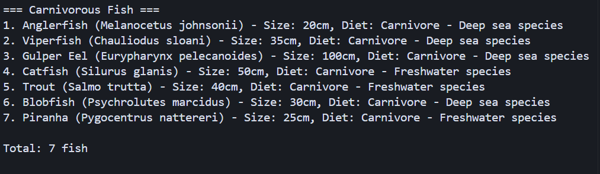
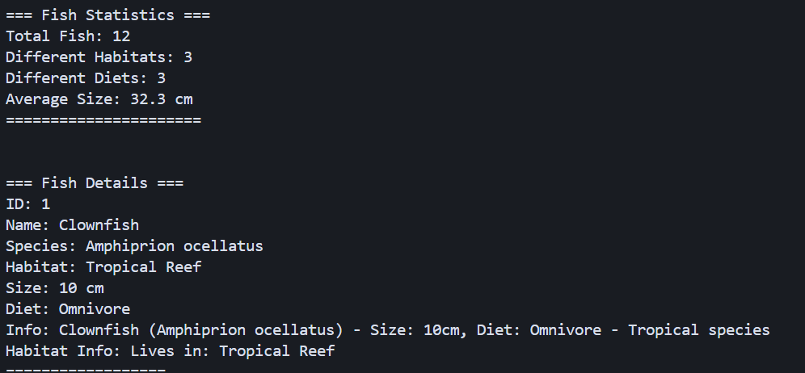
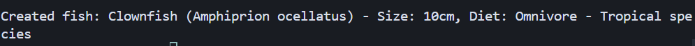

# SOLID Principles

## Author: Vladimir Vitcovschii

----

## Objectives:

* Get familiar with the Creational DPs;
* Choose a specific domain;
* Implement at least 3 SOLID principles;


## Used SOLID Principles: 

* Single Responsibility Principle
* Open-Closed Principle
* Liskov Substitution Principle


## Implementation

This TypeScript application demonstrates three fundamental SOLID principles through an ocean fish management system. The implementation showcases how these principles can be applied to create maintainable, extensible, and robust object-oriented software.

The Single Responsibility Principle is demonstrated through the clear separation of concerns across different classes. Each class has only one reason to change, with Fish models responsible solely for fish data and behavior, FishDisplay handling only presentation logic, FishService managing business operations, and FishRepository dealing exclusively with data access. The Open-Closed Principle is implemented through the repository system, where the BaseFishRepository is closed for modification but open for extension. New repository types like SampleFishRepository and JsonFishRepository can be added without changing existing code. The Liskov Substitution Principle is exemplified through the fish type hierarchy, where TropicalFish, DeepSeaFish, and FreshwaterFish are fully interchangeable with their base Fish class, and any repository implementation can be substituted in the FishService without breaking functionality.

```typescript
// Single Responsibility Principle - Each class has one responsibility
export class FishService {
  constructor(private fishRepository: IFishRepository) {}
  
  // Business logic only
  getLargeFish(minSize: number): IFish[] {
    return this.fishRepository.getAllFish().filter(fish => fish.size >= minSize);
  }
}

// Open-Closed Principle - Open for extension, closed for modification
export abstract class BaseFishRepository implements IFishRepository {
  abstract getAllFish(): IFish[];
  // Base implementation closed for modification
}

export class SampleFishRepository extends BaseFishRepository {
  // Extension without modification of base class
  getAllFish(): IFish[] {
    return this.sampleData;
  }
}

// Liskov Substitution Principle - Subtypes are substitutable
export class TropicalFish extends Fish {
  getInfo(): string {
    return `🐠 ${super.getInfo()} - Tropical species`;
  }
}
```

The application provides comprehensive fish management capabilities including habitat-based filtering, size-based categorization, and diet-based organization. Users can explore different fish types through an interactive console interface that demonstrates the practical application of SOLID principles in creating flexible and maintainable software systems.


## Conclusions / Screenshots / Results

The implementation successfully demonstrates how SOLID principles can be applied to create robust and maintainable software systems. The Single Responsibility Principle ensures each class has a clear, focused purpose, the Open-Closed Principle enables system extension without modification, and the Liskov Substitution Principle guarantees that derived classes can be used interchangeably with their base classes. These principles work together to create a flexible and extensible system that can easily accommodate new fish types and repository implementations while maintaining code quality and reducing coupling between components.

So the running of the code gives these results:

All fish list  


Deep sea fish list


Freshwater fish list


Large fish list


Small fish list


Carnivorous fish list


Total fish statistics + fish instance info


Creation of fish instance


